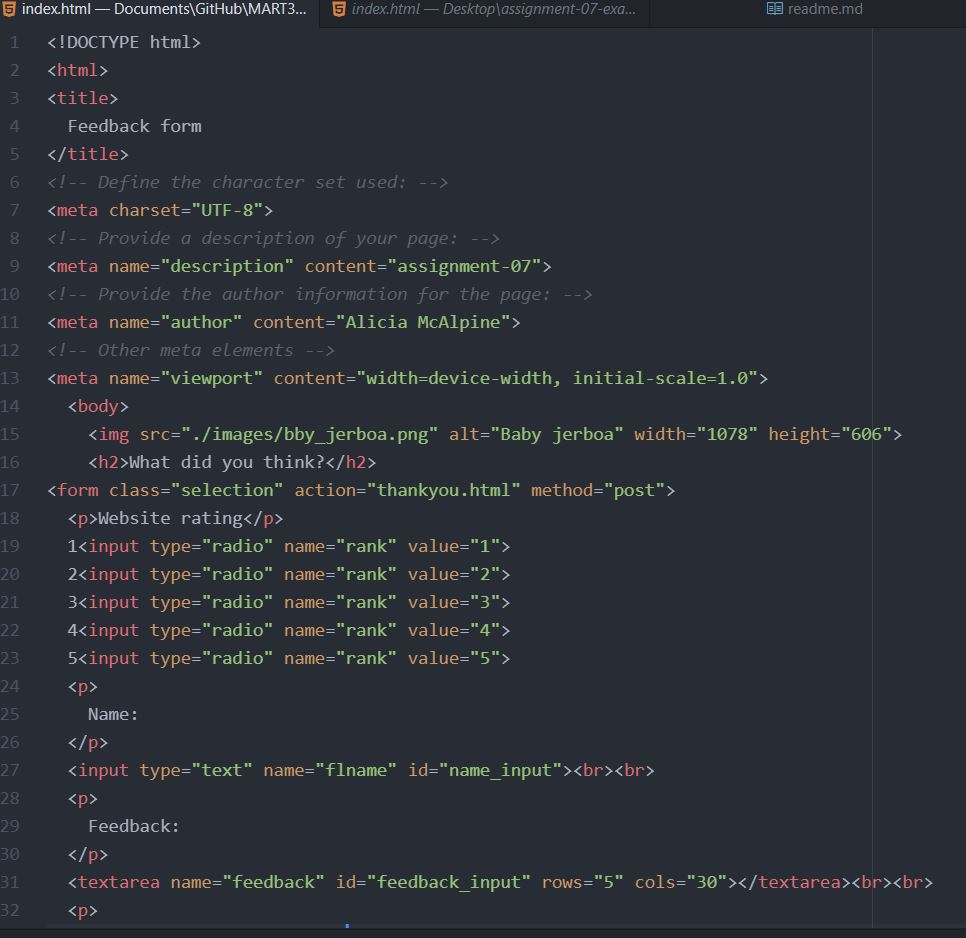

In browsing the web, I have used many different form elements. These include drop-down menus/multiple choice, password inputs, image uploads, buttons, and more. Most of these take you to a different screen and/or help you accomplish a task.

