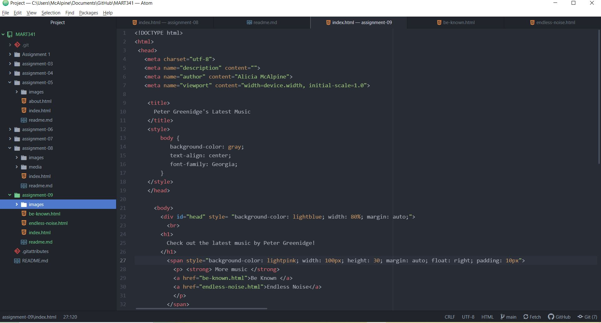

Recap: leaning HTML has been interesting and much easier than trying to learn Javascript, which I tried to do last semester. While there are more things I wish I knew how to do, it has given me a good baseline to be able to make a simple website, and the knowledge to build on to create more complex web pages in the future.
CSS: I have no idea what to expect, but I am looking forward to seeing how to make things look the way I want them to and give a more interesting experience to the user.

