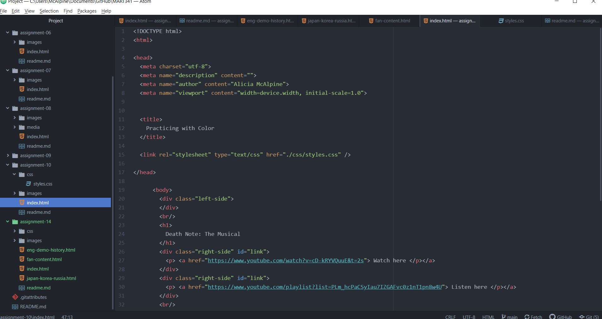

Universal, element, class, id Universal refers to something on the stylesheet that applies to the whole website and all its elements, however many pages it is. Elements apply to different html style elements, such as div or img. Class is for multiple elements on the same page, and id is just for one singular element. The more individualized you want your content to be, the farther down that list you should go.

For my palette, I chose colors (or closest approximations) that have symbolic significance in Death Note. The background color is solely chosen for the hex code.

